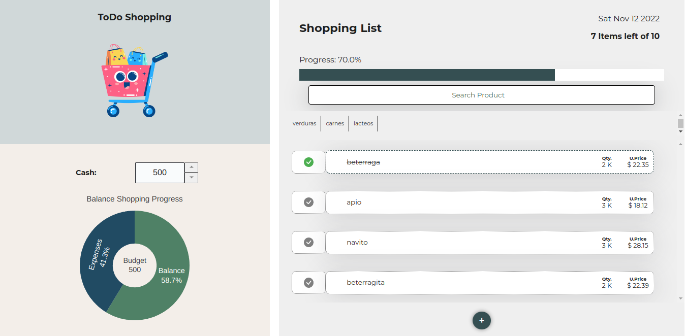
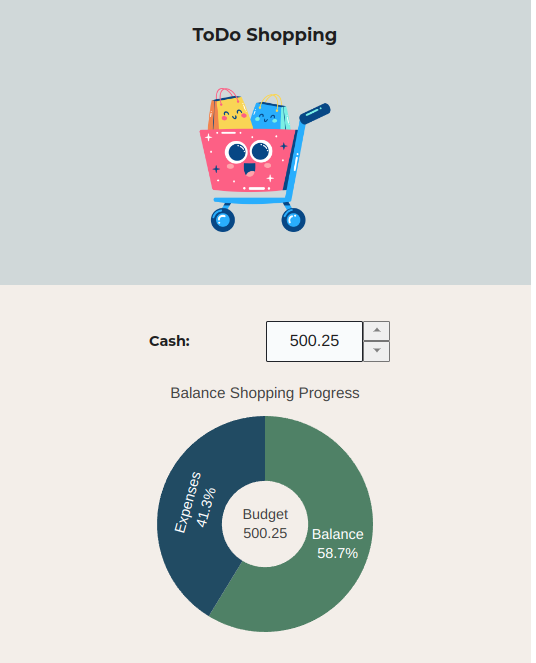
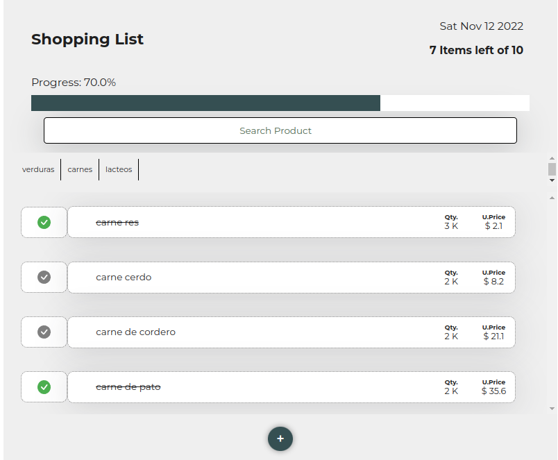
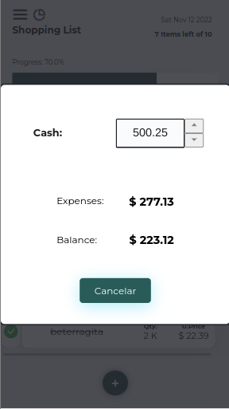
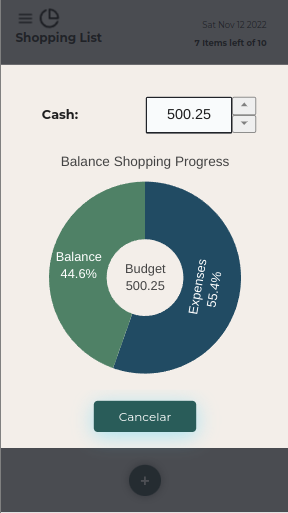

# ToDo Shopping
##
<figure>
  
  <figcaption>Shopping List application</figcaption>
</figure>

This project is a static page and consists of a shopping list, It could manage your shopping products when you are going to go to the mall or marketplace.

<b>Main features</b>:

- Set your budget or cash you are going to spend in your shopping
- Add products with the unit price and quantity.
- Add a category to group your products.
- Remove and edit name, price, and quantity.
- (Un)Complete every product that you have bought.
- View a report of your budget with the expenses and balance.
- View the progress of all your products
- It has a mobile and desktop responsive view.
<table>
  <tr>
    <th></th>
    <th></th>
  </tr>
  <tr>
    <td></td>
    <td></td>
  </tr>
  <tr>
    <td></td>
    <td></td>
  </tr>
</table>

I made this project for learning the basics of React using React components, hooks, states, etc. It begins like a Todo List but It becomes in a shopping list I see that I need deep more in  the functionalities and know how to manage many components using other frameworks.

I hope you enjoy and be useful this application for you

## Available Scripts

In the project directory, you can run:
### `npm start`
Runs the app in the development mode.\
Open [http://localhost:3000](http://localhost:3000) to view it in your browser.
The page will reload when you make changes.\
You may also see any lint errors in the console.
### `npm test`
Launches the test runner in the interactive watch mode.\
See the section about [running tests](https://facebook.github.io/create-react-app/docs/running-tests) for more information.
### `npm run build`
Builds the app for production to the `build` folder.\
It correctly bundles React in production mode and optimizes the build for the best performance.
